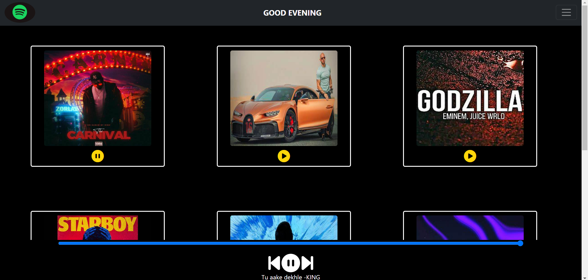
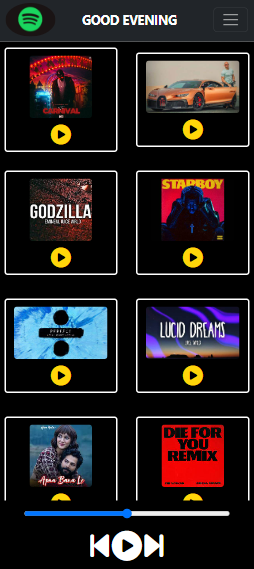

# Spotify-Clone

🎶Your musical sanctuary awaits! Dive into a handpicked selection of tracks, effortlessly control playback (▶️⏸️⏭️), and navigate with a friendly navbar greeting 📻. Experience the joy of quality music, made beautifully simple.
## Acknowledgements

 - [Bootstrap](https://getbootstrap.com/docs/4.0/components/navbar/)
 - [FontAwesome](https://fontawesome.com/)
 

## Link For Deploying Site : 
- (https://devansh-aage.github.io/Spotify-clone/spotify.html)

## Feedback

If you have any feedback, please reach out to us at devanshaage@gmail.com 

## Features

🎵 Curated Tracks: Discover a thoughtfully curated selection of songs, ensuring a premium listening experience.

⏯️ Playback Control: Seamlessly control your music with play, pause, and skip track functions, giving you total command over your audio journey.

📅 User-Friendly Navbar: Navigate effortlessly with an intuitive navbar, complete with a warm greeting for a personalized touch.

🚀 Constant Innovation: Expect ongoing updates and new features to keep your music experience fresh and exciting.

🌟 Quality First: We prioritize quality over quantity, offering only the finest tracks for your enjoyment.

🔒 Secure and Reliable: Rest easy knowing your music is delivered securely and reliably, just like your favorite music streaming platform.

📱 Responsive Design: Enjoy SoundClone on any device with our responsive design, ensuring a seamless experience wherever you go.

🌐 Cross-Platform Compatibility: Access SoundClone across various platforms and browsers, ensuring you're always in tune with your music.

🆓 Open Source: SoundClone is open source, allowing for community contributions and enhancements.

## Screenshots

